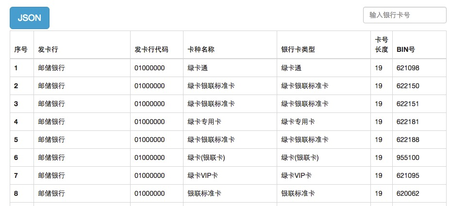

# BankCardList

##提供2799条银行卡BIN信息

### Demo


### JSON

```
{
  "00405512": {
    "bank": "交通银行",
    "bankCode": "03010000",
    "BIN": "00405512",
    "cardName": "太平洋互连卡",
    "cardNoLength": "17",
    "cardType": "借记卡"
  },
  "0049104": {
    "bank": "交通银行",
    "bankCode": "03010000",
    "BIN": "0049104",
    "cardName": "太平洋信用卡",
    "cardNoLength": "16",
    "cardType": "贷记卡"
  },
  "0053783": {
    "bank": "交通银行",
    "bankCode": "03010000",
    "BIN": "0053783",
    "cardName": "太平洋信用卡",
    "cardNoLength": "16",
    "cardType": "贷记卡"
  },
  "00601428": {
    "bank": "交通银行",
    "bankCode": "03010000",
    "BIN": "00601428",
    "cardName": "太平洋万事顺卡",
    "cardNoLength": "17",
    "cardType": "借记卡"
  },
.......
```
